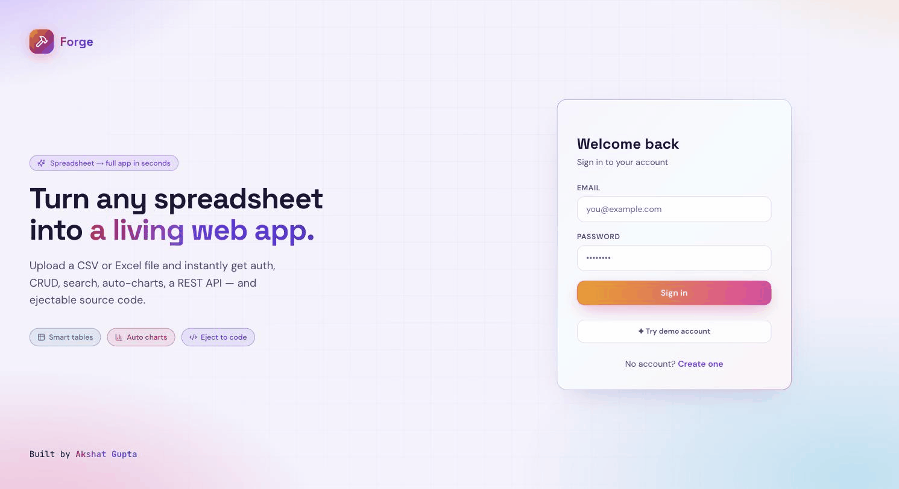
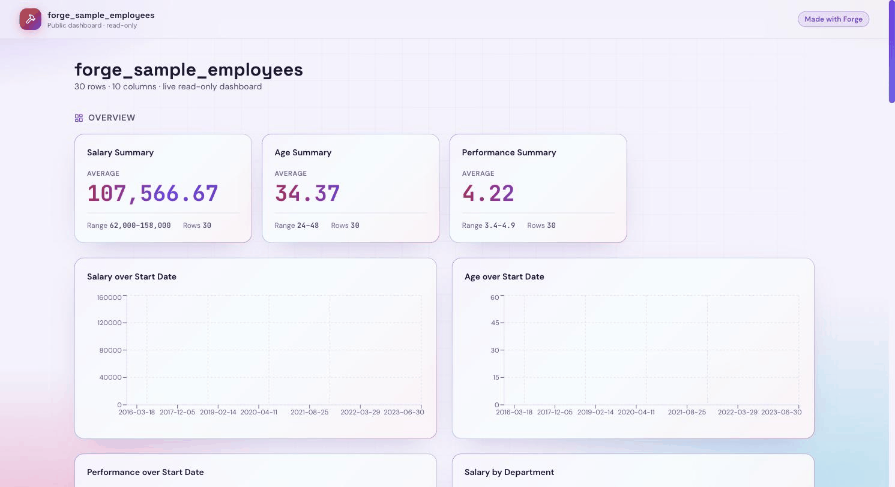

# Forge

**Turn any spreadsheet into a full web app — instantly.**

Upload a CSV or Excel file and Forge generates a complete application with authentication, CRUD operations, search, filters, auto-generated charts, and a REST API.

### 🔗 Live Demo

**App:** [forge-opal-one.vercel.app](https://forge-opal-one.vercel.app) · **API docs:** [forge-21mm.onrender.com/docs](https://forge-21mm.onrender.com/docs) · **Example shared dashboard:** [live link](https://forge-opal-one.vercel.app/share/asNpnVuKDCUFs-QI)

Sign in with the demo account — **`demo@forge.app`** / **`demo12345`** — or click *Try demo account*.

> Hosted on free tiers (Vercel + Render + Neon). The backend may take ~50s to wake on the first request after inactivity.



> Upload a spreadsheet → Forge auto-builds a dashboard with KPIs, charts, and a searchable table:



## Features

**Ingest & understand**
- **Upload** CSV or Excel (`.csv` / `.xlsx` / `.xls`) via drag-and-drop.
- **Smart schema inference** — a two-pass engine auto-detects each column's type (boolean, integer, float, currency, date, email, URL, enum, string) at an 80% confidence threshold.

**Work with the data**
- **Interactive table** — full-text search, per-column sort, pagination, and type-aware rendering (emails as links, booleans as colored Yes/No, currency, dates).
- **Full CRUD** via **type-aware forms** — each column type maps to the right input (checkbox, dropdown, date picker, number field) automatically.
- **CSV export** — one-click download.

**Auto-generated dashboards**
- **Rule-based charts** with zero config: KPI cards for numerics, line charts for time series, bar charts for category-vs-numeric, donut charts for distributions.

**Ship it — two outputs**
- **Public share link** → a live, hosted, read-only **dashboard** (KPIs + charts + searchable table) at `/share/{token}`. No login, sendable to anyone.
- **Eject to code** → download a complete, standalone **Next.js + FastAPI** project — typed SQLAlchemy models, Pydantic schemas, a real CRUD REST API, seed data, and a React UI. Runnable, no lock-in.

**Platform**
- **REST API** — every operation is an OpenAPI-documented endpoint at `/docs`.
- **Auth & multi-tenancy** — JWT authentication with per-user data isolation (+ a demo account).

## Architecture

| Layer | Technology |
|-------|-----------|
| Frontend | Next.js 14 · Tailwind CSS · Zustand · React Query · Recharts |
| Backend | FastAPI · SQLAlchemy 2 · Pydantic v2 · JWT Auth |
| Database | PostgreSQL (JSONB) · SQLite (dev) |
| Cache | Redis · In-process fallback |
| Deploy | Vercel · Render · Neon · Upstash |

## Quick Start

```bash
# Clone
git clone https://github.com/Ak5hat-Gupta/Forge.git
cd Forge

# Docker (recommended)
docker compose up --build

# Or manual setup
cd backend && python3 -m venv .venv && source .venv/bin/activate && pip install -r requirements.txt
cd ../web && npm install

# Run
make api    # Backend on :8000
make web    # Frontend on :3000
make seed   # Create demo user
```

**Demo credentials:** `demo@forge.app` / `demo12345`

## How It Works

1. **Upload** — Drop a CSV/Excel file
2. **Infer** — Two-pass algorithm samples rows, classifies 10 types at 80% confidence
3. **Store** — Data saved as JSONB rows with GIN index for fast queries
4. **Render** — Auto-generated table, forms, and charts based on schema

## API Endpoints

| Method | Endpoint | Description |
|--------|----------|-------------|
| POST | `/api/v1/auth/register` | Create account |
| POST | `/api/v1/auth/login` | Sign in |
| GET | `/api/v1/auth/me` | Current user |
| GET | `/api/v1/spreadsheets` | List spreadsheets |
| POST | `/api/v1/spreadsheets/upload` | Upload CSV/Excel |
| GET | `/api/v1/spreadsheets/{id}` | Get spreadsheet + schema |
| DELETE | `/api/v1/spreadsheets/{id}` | Delete spreadsheet |
| GET | `/api/v1/spreadsheets/{id}/rows` | Query rows (paginated, filtered, sorted) |
| POST | `/api/v1/spreadsheets/{id}/rows` | Create row |
| PUT | `/api/v1/spreadsheets/{id}/rows/{row_id}` | Update row |
| DELETE | `/api/v1/spreadsheets/{id}/rows/{row_id}` | Delete row |
| GET | `/api/v1/spreadsheets/{id}/charts/recommend` | Get chart recommendations |
| GET | `/api/v1/spreadsheets/{id}/charts/data` | Get chart data |
| GET | `/api/v1/spreadsheets/{id}/eject` | Download generated project (ZIP) |
| GET | `/api/v1/spreadsheets/{id}/eject/preview` | Preview generated files |
| POST | `/api/v1/spreadsheets/{id}/share` | Enable/disable public share link |
| GET | `/api/v1/public/{token}/rows` | Public read-only rows (no auth) |

## Project Structure

```
Forge/
├── backend/
│   ├── app/
│   │   ├── api/           # FastAPI route handlers
│   │   ├── core/          # Config, auth, database, cache, middleware
│   │   ├── models/        # SQLAlchemy models
│   │   ├── repositories/  # Data access layer
│   │   ├── schemas/       # Pydantic request/response models
│   │   ├── services/      # Business logic (inference, ingestion, charts, codegen)
│   │   └── templates/     # Jinja2 templates for the "eject to code" generator
│   └── tests/
├── web/
│   └── src/
│       ├── app/           # Next.js pages (App Router)
│       ├── components/    # React components
│       ├── lib/           # API client, types, utilities
│       └── store/         # Zustand state management
├── docker-compose.yml
├── render.yaml
└── Makefile
```

## License

MIT — Akshat Gupta
